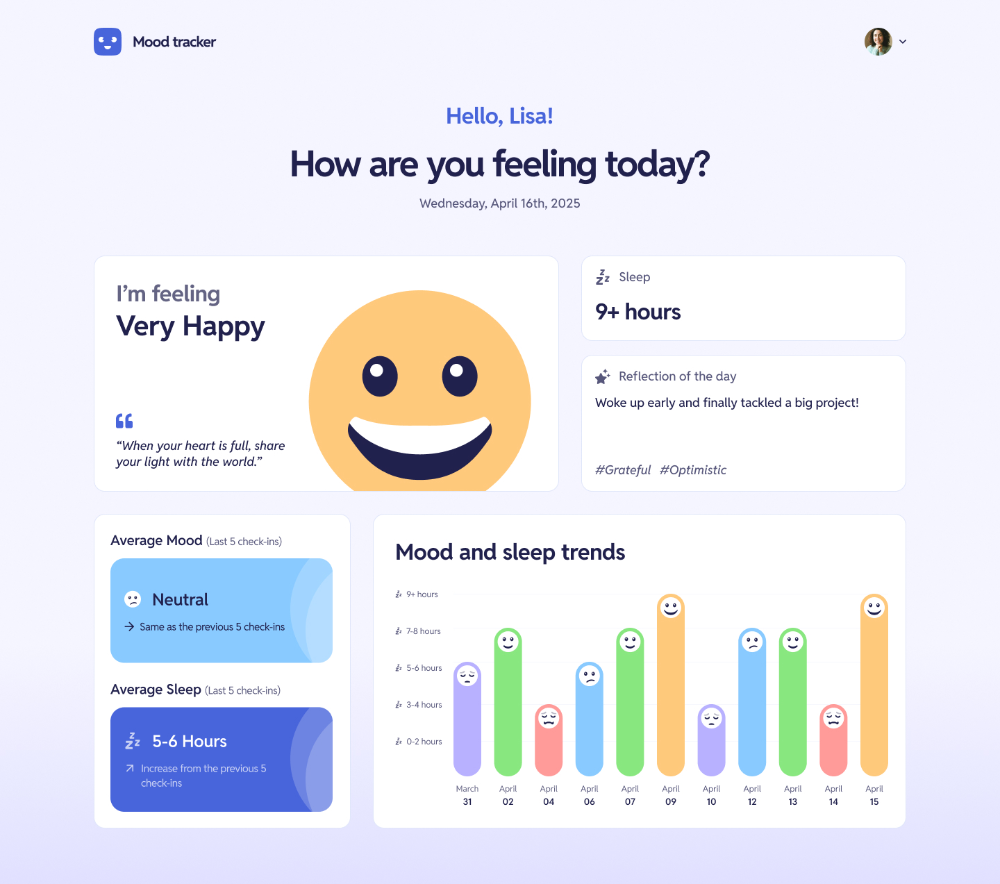

# [Mood Tracker](https://mood-tracking.up.railway.app/)

An AI-assisted mood tracking application designed to help users reflect on their emotions, identify patterns, and build greater self-awareness through journaling and insights.

Built with a focus on thoughtful user experience, emotional reflection, and practical AI integration using [Gemini 2.5 Flash](https://deepmind.google/technologies/gemini/flash/).

---

## ✨ Features

* 📖 Daily mood tracking and journaling
* 🤖 AI-assisted emotional reflection, advice, and mottos
* 📊 Mood trends and pattern awareness through average mood and sleep hours
* 🎨 Clean and user-centered UI
* ⚡ Modern full-stack architecture

---

## 🛠 Tech Stack

### Frontend

* Next.js
* React
* TypeScript

### Backend

* ASP.NET Core 10
* Entity Framework Core
* C#

### Database

* PostgreSQL

### AI Integration

* Gemini 2.5 Flash

---

## 💡 Project Vision

This project explores how AI can support emotional reflection in a meaningful and human-centered way.

Rather than building AI purely as a technical showcase, the goal was to create an experience that feels supportive, reflective, and intentional — combining software engineering, product thinking, and UX design into a cohesive application.

---

## 🚀 Getting Started

### Prerequisites

* Node.js
* .NET 10 SDK
* PostgreSQL

---

## Backend Local Setup

### Environment Variables

Create a `.env` file and configure the required environment variables before running locally.

```env
Cloudinary__URL=[YOUR_CLOUDINARY_API_KEY]   # I use CLoudinary to host images. You can use something else, but you need to configure it accordingly
Cors__ClientUrl=[YOUR_LOCAL_FRONTEND_URL]
CronSecret=[YOUR_CRON_SECRET]               # [Optional] For running cron job. This is not needed if you run the backend locally
DATABASE_URL=[YOUR_DATABASE_URL]            # I'm currently using PostgreSQL. You can use something else, but you need to configure it accordingly
Gemini__ApiKey=[YOUR_GEMINI_API_KEY]        # The API key for using Gemini
Jwt__Key=[YOUR_JWT_KEY]                     # Signing Key for JWT
```
### Run the backend locally

```bash
cd server
dotnet restore
dotnet run --launch-profile http
```

---

## Frontend Local Setup

### Environment Variables

Create a `.env` file and configure the required environment variables before running locally.

```env
API_BASE_URL=[YOUR_BACKEND_LOCAL_URL]
GUEST_EMAIL=[DEFAULT_GUEST_EMAIL]                # Your Guest User Email. See the backend setup
GUEST_PASSWORD=[DEFAULT_GUEST_PASSWORD]          # Your Guest User Password. See the backend setup
IMAGE_DOMAIN=[YOUR_EXTERNAL_IMAGE_HOST_DOMAIN]   # e.g., res.cloudinary.com
```

### Run the frontend locally

```bash
cd client
npm install
npm run dev
```

---

## Environment Variables

Create a `.env` file and configure the required environment variables.

Example:

```env
GEMINI_API_KEY=your_api_key
DATABASE_CONNECTION_STRING=your_connection_string
```

---

## 📷 Preview



---

## 📚 What I Learned

* Integrating AI into real-world product experiences
* Designing reflective user interactions
* Building full-stack applications with React and ASP.NET Core
* Managing application architecture and API communication
* Balancing UX design with technical implementation

---

## 🔮 Future Improvements

* Mood analytics and visualization
* Personalized AI insights
* Authentication and user profiles
* Notifications and journaling reminders
* Mobile responsiveness improvements
* Exporting mood history and reports

---

## 🤝 Contributing

Contributions, ideas, and feedback are welcome.

---

## 📄 License

This project is licensed under the MIT License.
